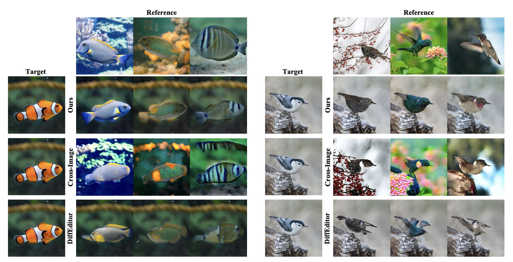

# Eye-for-an-eye: Appearance Transfer with Semantic Correspondence in Diffusion Models

[arXiv](https://arxiv.org/abs/2406.07008) | [Project Page](https://sooyeon-go.github.io/eye_for_an_eye/)

> **Eye-for-an-eye: Appearance Transfer with Semantic Correspondence in Diffusion Models**<br>
> [Sooyeon Go](https://sooyeon-go.github.io/), [Kyungmook Choi](https://chkmook.github.io/), [Minjung Shin](https://minjung-s.github.io/), [Youngjung Uh](https://vilab.yonsei.ac.kr/member/professor)<br>
> 
>**Abstract**: <br>
As pretrained text-to-image diffusion models have become a useful tool for image synthesis, people want to specify the results in various ways. In this paper, we introduce a method to produce results with the same structure of a target image but painted with colors from a reference image, especially following the semantic correspondence between the result and the reference. E.g., the result wing takes color from the reference wing, not the reference head. Existing methods rely on the query-key similarity within self-attention layer, usually producing defective results. To this end, we propose to find semantic correspondences and explicitly rearrange the features according to the semantic correspondences. Extensive experiments show the superiority of our method in various aspects: preserving the structure of the target and reflecting the color from the reference according to the semantic correspondences, even when the two images are not aligned.



## Description  
Official implementation of our Eye-for-an-eye: Appearance Transfer with Semantic Correspondence in Diffusion Models paper.


## Environment
Our code builds on the requirement of the `diffusers` library. To set up their environment, please run:
```
git clone https://github.com/sooyeon-go/eye_for_an_eye.git
cd eye_for_an_eye
conda env create -f environment/environment.yaml
conda activate eye_for_eye
```

(Optional) You may also want to install [SAM-HQ](https://github.com/SysCV/sam-hq) to extract the instance masks:
```
pip install git+https://github.com/SysCV/sam-hq.git.
```
Please download the ViT-L HQ-SAM model from the provided link.


## Prepare the data

### Step 1: Create a Data Folder
- Create a `your_data_folder`.(For example, [example](/example/))
- Place your source and target data inside this folder.

### Step 2: Generate Bounding Box
- Open and run the [make_bbox.ipynb](make_bbox.ipynb).
- This notebook will generate and save bbox for your data.

## Perform Appearance Transfer(Single Object version)

```
python run.py \
--app_image_path example/0.jpg \ # Appearance image directory
--struct_image_path example/1.jpg \ # Structure image directory
--output_path output \
--domain_name bird \ # Domain of image
--use_masked_adain True \
--guidance_scale 2.5 \
--mask_use True \
--bbox_path example/crop_box.json
```
Notes:
- You can adjust the guidance scale from completely removed to 2.5. Without guidance, you can get more accurate matching and the structure is preserved well. However, the result quality may not be as good. Conversely, providing guidance can give good result quality, even if it slightly deviates from the target's structure.
- Adjusting '--feat_range' and '--adain_range' may improve result quality.(In most cases, the default values provided the best performance).
- If you do not use a mask, you cannot preserve the background of the target image.
- You can use '--do_v_swap' to see the difference between the V injection and Feature injection discussed in the paper.
- We used the correspondence matching method from DIFT, but if there is a better matching approach available, it can be utilized to enhance the result matching quality.

Below codes coming Soon!

## Perform Appearance Transfer(Multi object version)


## Demo

## Citation
If you use this code for your research, please cite the following work: 
```
@misc{go2024eyeforaneye,
      title={Eye-for-an-eye: Appearance Transfer with Semantic Correspondence in Diffusion Models}, 
      author={Sooyeon Go and Kyungmook Choi and Minjung Shin and Youngjung Uh},
      year={2024},
      eprint={2406.07008},
      archivePrefix={arXiv},
      primaryClass={cs.CV}
}
```

## Acknowledgement

Our code is largely based on the following open-source projects: [DIFT](https://github.com/Tsingularity/dift.git), [Cross-image-attention](https://github.com/garibida/cross-image-attention.git). Our heartfelt gratitude goes to the developers of these resources!